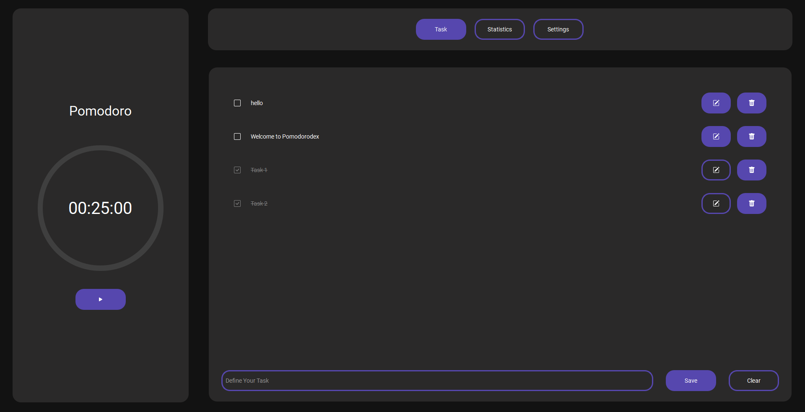

# Pomodorodex
----------------------

**Your Ultimate Productivity Companion!**

Pomodorodex is a versatile productivity application designed to enhance your focus, productivity, and time management. With its intuitive interface and powerful features, Pomodorodex is the ideal tool for professionals, students, and anyone looking to maximize their work efficiency.

## Key Features:
----------------------

### 🍅 Pomodoro Timer
Boost your productivity with the renowned Pomodoro Technique. Set customized time intervals for focused work sessions and rejuvenating breaks, ensuring optimal productivity throughout the day.

### 📋 Task Management
Seamlessly organize your tasks, projects, and to-do lists within Pomodorodex. Prioritize, categorize, and track your progress effortlessly, ensuring that you stay on top of your goals.

### 🎵 Customizable Music
Enhance your work environment with customizable music options. Choose your favorite tunes to accompany your work sessions and breaks, making your productivity experience personalized and enjoyable.

### 📊 Stats Tracking
Gain valuable insights into your work habits and accomplishments with comprehensive statistics tracking. Analyze your productivity trends over time, empowering you to make data-driven decisions for improved performance.

### ⚙️ Customizable Sessions
Tailor your Pomodoro sessions to your preferences. Set the duration of Pomodoro and break sessions, as well as the number of sessions in a work block. Customize your work environment to match your unique workflow.

## Bugs/Issues:
----------------------

- Pomodoro Timer continues running while the timer is paused.
- Audio only plays during one routine and needs to be selected again.
- Light mode does not properly show.
- Slider starts Timer while scrolling.
- Statistics should be updated in real-time.

## Sources:
----------------------

### Icons:

- [Bootstrap](https://github.com/twbs/icons/releases/tag/v1.11.1)
- Pomodordex-icon: me (generated with Stable-Diffusion)

### Audio:

- [Ticking Sound](https://pixabay.com/sound-effects/ticking-clock-1-27477/)
- [Notification Sound](https://pixabay.com/sound-effects/service-bell-ring-14610/)
- [LAKEY INSPIRED - Blue Boi](https://www.youtube.com/watch?v=wAukvwLCVbM)
- [Eine kleine Nachtmusik - Mozart](https://archive.org/download/SerenadeNo.13EineKleineNachtmusikK.525)

Enjoy the power of Pomodorodex and make every work session count!
